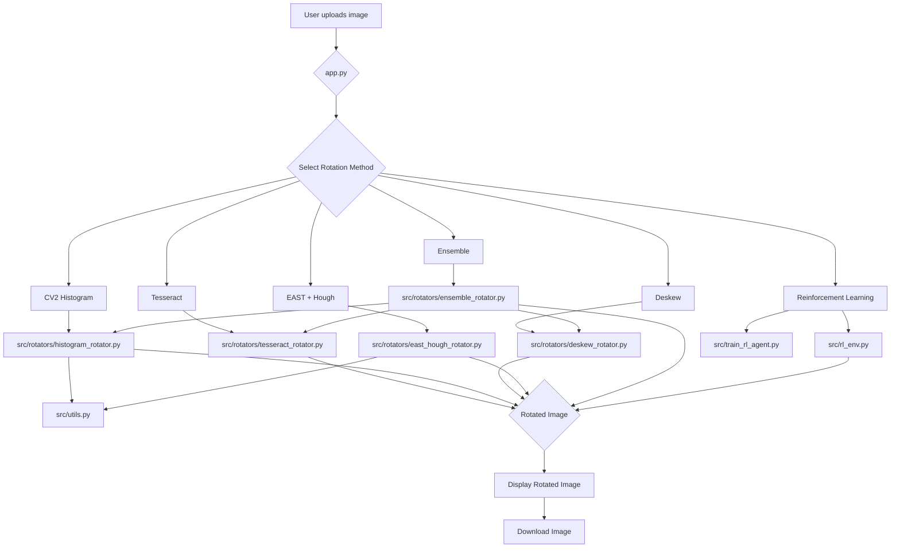

# Image Rotation and Deskewing Tool

This Streamlit application provides a user-friendly interface to correct the orientation of images using various methods.

## Features

- **Tesseract-based Rotation**: Uses Tesseract OCR to detect text orientation and rotate the image accordingly.
- **CV2 Histogram-based Rotation**: Analyzes the sharpness of the horizontal projection profile to find the best alignment angle.
- **Deskew Package Method**: A dedicated library for skew correction.
- **Edge Detection + Hough Transform**: Finds the document's dominant angle via edge detection.
- **EAST Text Detector + Hough Transform**: A deep learning method to find text boxes and determine the rotation angle.
- **Ensemble Learning**: Combines the predictions from multiple models to create a more robust and accurate orientation correction system.
- **Evaluation Metrics**: Allows the user to evaluate the performance of the models using metrics such as Accuracy, Mean Absolute Error (MAE), and Root Mean Squared Error (RMSE).
- **Real-time Adaptation**: Allows the user to provide feedback on the corrected image to update the ensemble model in real-time.
- **Reinforcement Learning**: Uses a trained reinforcement learning agent to predict the orientation of an image.

## Installation

1. Clone the repository:
   ```bash
   git clone https://github.com/your-username/image-rotation-deskew-tool.git
   cd image-rotation-deskew-tool
   ```

2. Create a virtual environment and install the dependencies using `uv`:
   ```bash
   uv venv
   uv pip install -r requirements.txt
   ```

3. For the EAST method, you need to download the pre-trained model file `frozen_east_text_detection.pb` and place it in the root directory of the project.

## Development

This project uses `ruff` for linting and formatting, and `pre-commit` to run checks before each commit.

To set up the development environment, install the pre-commit hooks:

```bash
pre-commit install
```

Now, `ruff` will automatically check and format your code every time you make a commit.

## How to Run

To run the Streamlit application, execute the following command in your terminal:

```bash
streamlit run app.py
```

## Code Flow

The application is structured into several modules:

- `app.py`: The main Streamlit application file that handles the UI and user interactions.
- `src/utils.py`: Contains utility functions shared across different modules.
- `src/rotators/`: This directory contains the different rotation methods, each in its own file.
  - `tesseract_rotator.py`: Tesseract-based rotation.
  - `histogram_rotator.py`: CV2 Histogram-based rotation.
  - `deskew_rotator.py`: Deskew package-based rotation.
  - `east_hough_rotator.py`: EAST text detector and Hough transform-based rotation.
  - `ensemble_rotator.py`: Ensemble learning-based rotation.
  - `rl_env.py`: A simple reinforcement learning environment.
  - `train_rl_agent.py`: A script for training the reinforcement learning agent.

Here is a diagram illustrating the code flow:



## Comparison of Approaches

Based on the chat history, here is a comparison of the different image orientation correction approaches discussed:

| Method | Pros | Cons | Best For |
| --- | --- | --- | --- |
| **Tesseract OSD** | Simple to implement, uses a well-established OCR engine. | Can be inaccurate for images with no text or non-standard fonts. | Images with clear, horizontal text. |
| **CV2 Histogram** | Fast and effective for documents with clear text blocks. | Less effective for images with complex layouts or non-uniform text. | Scanned documents with uniform text blocks. |
| **Deskew Package** | A dedicated library for skew correction, easy to use. | May not handle large rotation angles. | Correcting minor skew in scanned documents. |
| **Edge Detection + Hough Transform** | Good for finding the dominant angle of a document. | Can be sensitive to noise and non-document edges. | Scanned documents with clear edges. |
| **EAST Text Detector + Hough Transform** | A powerful deep learning method that can detect text at various angles. | Requires a pre-trained model, can be computationally expensive. | Images with text at various angles and orientations. |
| **Simulated Annealing** | A global optimization method that can find the optimal orientation. | Can be slow and requires a well-defined objective function. | Complex cases where other methods fail. |

### Recommendation

For a general-purpose image orientation correction system, the **EAST Text Detector + Hough Transform** method is the most promising approach. It is robust and can handle a wide variety of images with text at different angles.

For scanned documents with minor skew, the **Deskew Package** or the **CV2 Histogram** method can be a good choice due to their speed and simplicity.

For a more advanced system, a combination of methods could be used. For example, the system could first try a fast method like the CV2 Histogram, and if the confidence is low, it could fall back to the EAST Text Detector.
