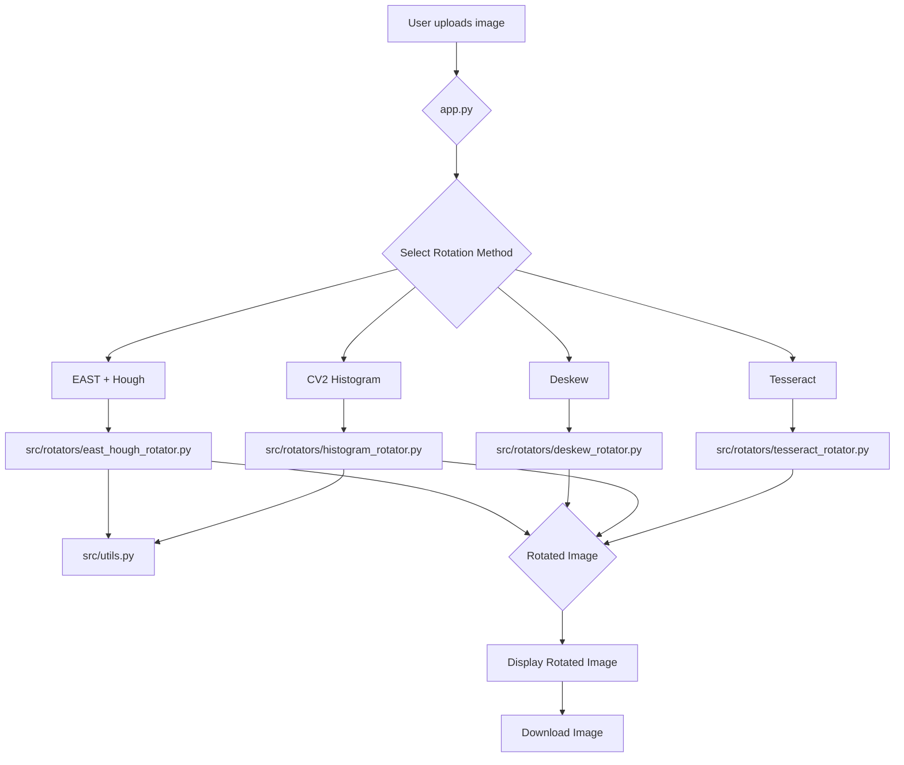

# Image Rotation and Deskewing Tool

This Streamlit application provides a user-friendly interface to correct the orientation of images using various methods.

## Features

- **Tesseract-based Rotation**: Uses Tesseract OCR to detect text orientation and rotate the image accordingly.
- **CV2 Histogram-based Rotation**: Analyzes the sharpness of the horizontal projection profile to find the best alignment angle.
- **Deskew Package Method**: A dedicated library for skew correction.
- **Edge Detection + Hough Transform**: Finds the document's dominant angle via edge detection.
- **EAST Text Detector + Hough Transform**: A deep learning method to find text boxes and determine the rotation angle.

## Installation

1. Clone the repository:
   ```bash
   git clone https://github.com/your-username/image-rotation-deskew-tool.git
   cd image-rotation-deskew-tool
   ```

2. Create a virtual environment and install the dependencies using `uv`:
   ```bash
   uv venv
   uv pip install -r requirements.txt
   ```

3. For the EAST method, you need to download the pre-trained model file `frozen_east_text_detection.pb` and place it in the root directory of the project.

## Development

This project uses `ruff` for linting and formatting, and `pre-commit` to run checks before each commit.

To set up the development environment, install the pre-commit hooks:

```bash
pre-commit install
```

Now, `ruff` will automatically check and format your code every time you make a commit.

## How to Run

To run the Streamlit application, execute the following command in your terminal:

```bash
streamlit run app.py
```

## Code Flow

The application is structured into several modules:

- `app.py`: The main Streamlit application file that handles the UI and user interactions.
- `src/utils.py`: Contains utility functions shared across different modules.
- `src/rotators/`: This directory contains the different rotation methods, each in its own file.
  - `tesseract_rotator.py`: Tesseract-based rotation.
  - `histogram_rotator.py`: CV2 Histogram-based rotation.
  - `deskew_rotator.py`: Deskew package-based rotation.
  - `east_hough_rotator.py`: EAST text detector and Hough transform-based rotation.

Here is a diagram illustrating the code flow:


